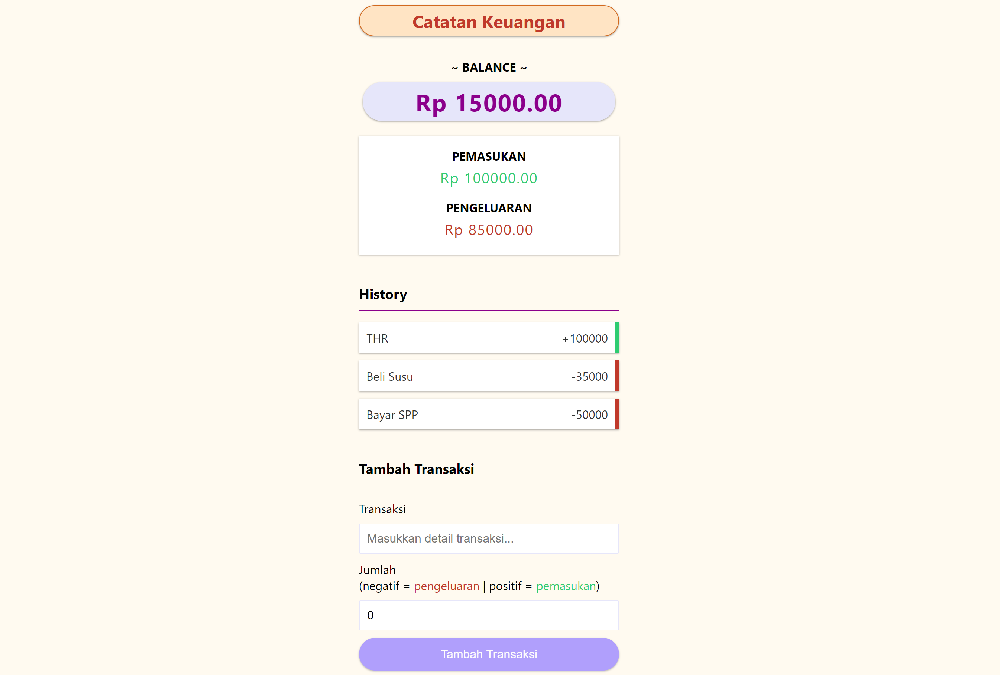

# Catatan Keuangan

> Membangun MERN Stack Application Catatan Keuangan
> CRUD Application, tetapi tanpa fungsi untuk 'Update/Edit'

## Demo

Demo aplikasi dapat diakses dengan link berikut: [Catatan Keuangan](https://rifandani-catatan-keuangan.herokuapp.com/)

## Prerequisites

- Download dan Install NodeJS
- Download dan Install NPM

## Installation

```
# clone repository
$ git clone https://github.com/rifandani/catatan-keuangan.git

# masuk ke app's directory project ini
$ cd expense-tracker

# install app's dependencies di root folder dan client folder
$ npm install
```

## Usage

```
# ganti NODE_ENV ke development dari file config.env, lalu jalankan perintah berikut di root folder
$ npm run dev
```

Lalu, buka localhost dengan browser anda.
